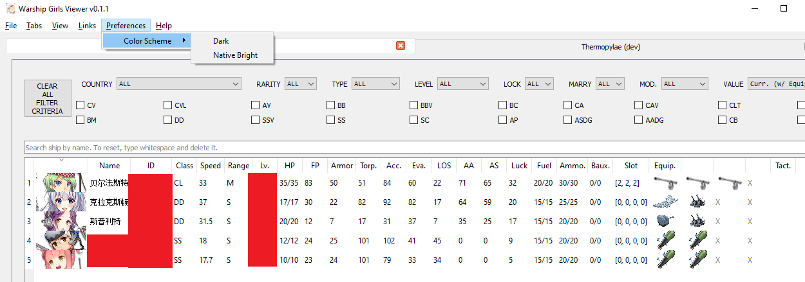
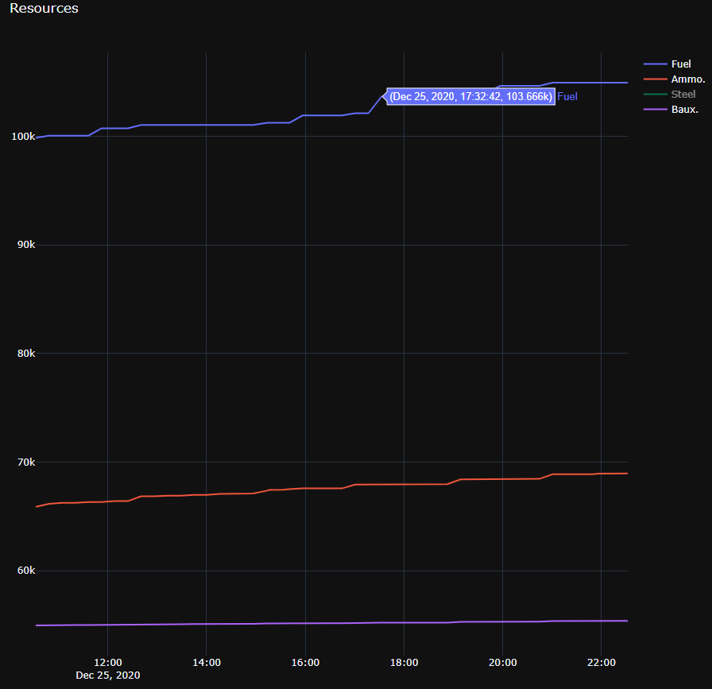
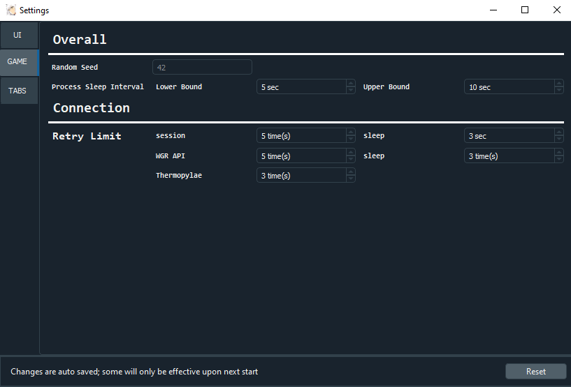
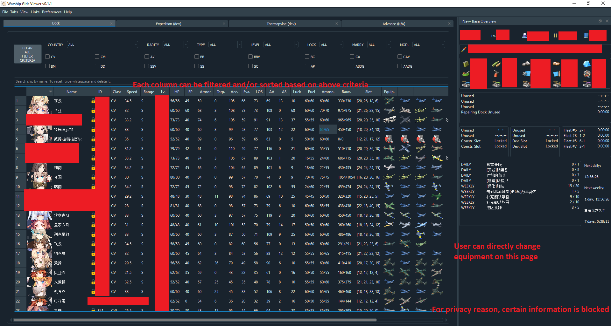
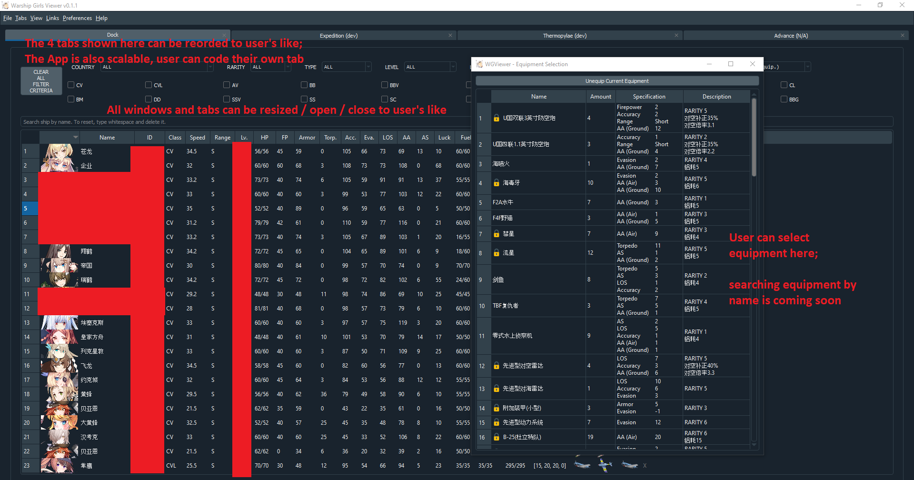
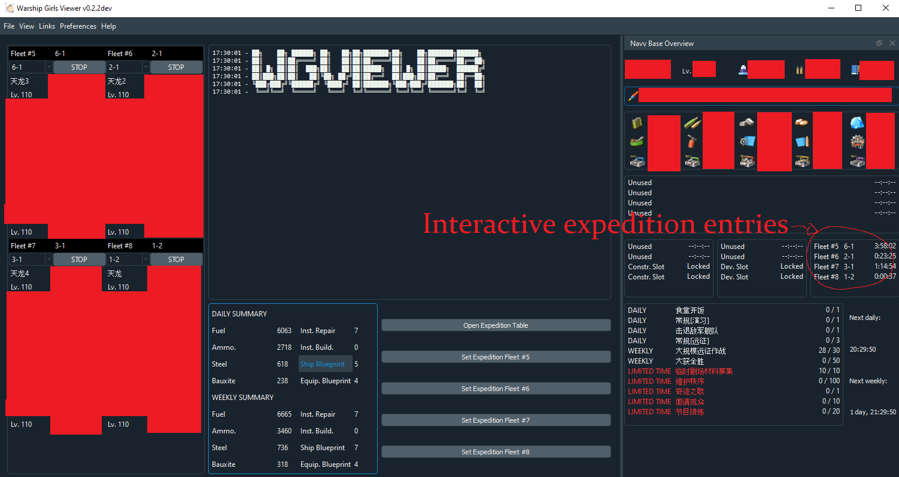
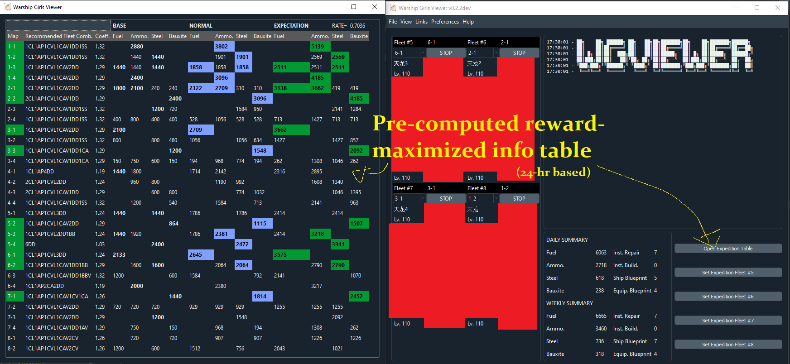
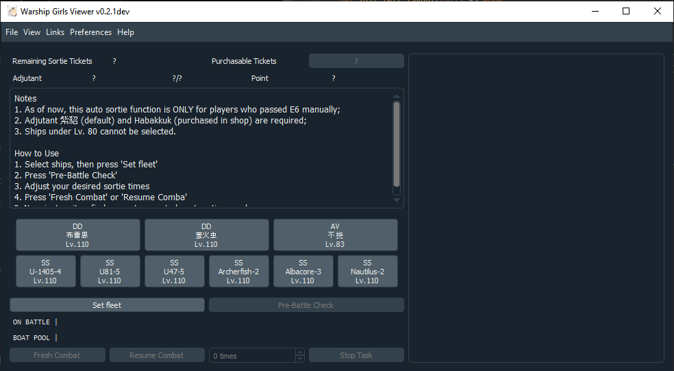
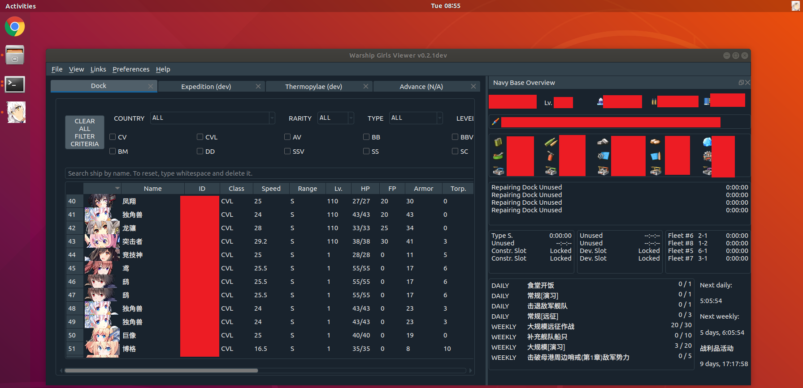
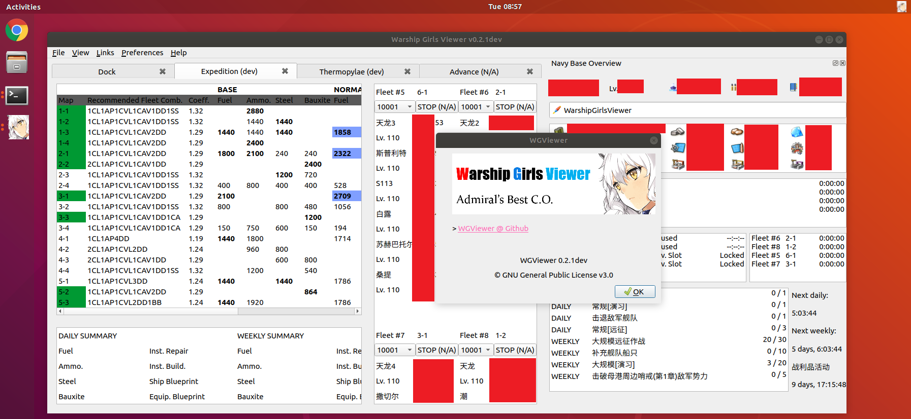

# Screenshots

## Functional

This part demonstrates fully functional features.

### General

> Login page

> Bright color scheme

> Interactive data graph (logging user resources)

> Settings (allow extensive control over important parameters)

### Tab Dock

> Direct equipment selection in user dock
>

### Tab Expedition

> Auto (& Manual) performs expedition tasks

> Informative expedition table

### Tab Thermopylae

> Auto sortie & purchasing tickets on Thermopylae Ex-6 mode

### Linux

These screenshots took under Ubuntu OS.

## WIP

This part demonstrates Work In Progress features.

N/A